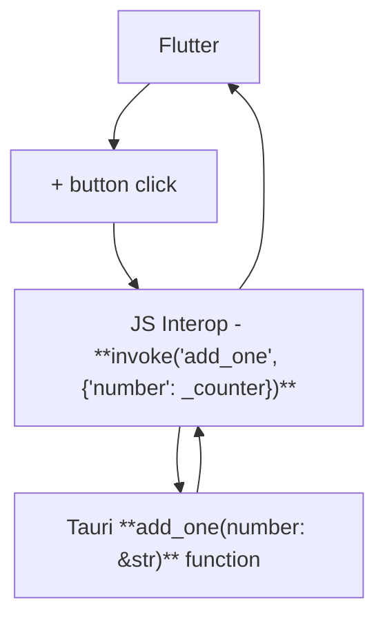

# Tauri + Flutter Web

This is a simple example of how to use Tauri 2 with Flutter Web.

## Requirements

- [Flutter](https://flutter.dev/docs/get-started/install)
- [Bun](https://bun.sh/)
- [Node.js](https://nodejs.org/en/)
- [Rust](https://www.rust-lang.org/tools/install)

## How to run

1. Clone this repository
2. Run `bun run dev` in the root folder

## How it works

First it runs the Flutter web app in web server mode at `localhost:5000` and then it runs the Tauri app that loads the Flutter web app in a webview.

### Communication

## Few things to note

- The Flutter web app needs to be running in a web server to work properly and you can't hot restart it by pressing `r` in the terminal. You need to stop the Tauri app and run `bun run dev` again.
- Can't seem to attach Flutter devtools to the Flutter web app running in the Tauri app.
- After the first run, the app may not load, right click on the app and click on `reload` - refresh the page.
